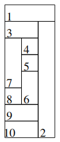

# Minimum Set Cover

A cool AI project to solve the Minimum Set Cover problem for partitions of a rectangle.
The objective is to cover all the rectangles we are expected to by using the minimum number of vertexes possible.

## How It Works

This is a tool developed in **Java** and **ECLiPSe CLP** using several approaches to the problem. To use the tool, you can run the _run.sh_ script and follow the given steps to choose a method and input file. In the first time, you must compile it with _compile_and_run.sh_

## The Input Files

The input files **must** use the following format:

- In the first line, we have an integer with the number of problem instances in the file.

Then, for each instance, we have:

- An integer representing the number of rectangles

Then, for each rectangle, we have:

- The rectangle identifier

- An integer representing the number of vertexes that cover that rectangle

Then, for each vertex, we have:

- Two integers, representing their coordinates.

Finally at the end of the file, we have:

- An integer representing the number of rectangles to cover followed by their identifiers

In the file [data1.txt](./data1.txt) we have a very small example corresponding to the following image.

## About the Approaches

(...)
